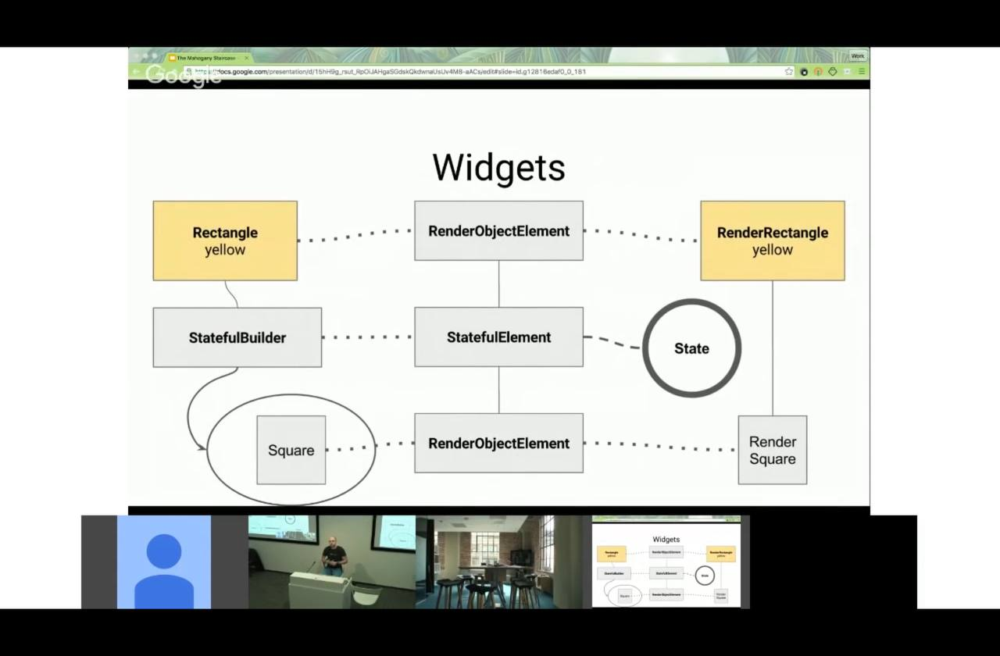
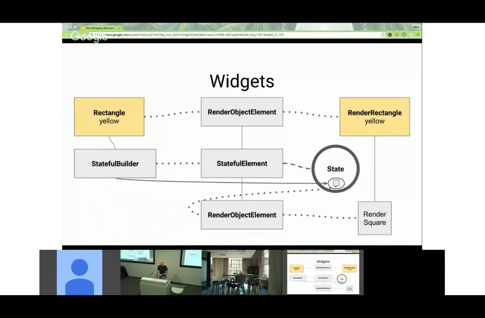

# [How Flutter Works Under The Hood (Press me)](https://m.youtube.com/watch?v=dkyY9WCGMi0)

Widgets are immutable but cheap

Since widget is immutable, its child connection is also immutable. However the same child can be a child for multiple parents. Only that the parent cannot “switch out” its child

We use build to have only one code path to update all widget configurations insted of two for lower render objects. Render objects have two code paths, one to update one to initialize like traditional developments.

It is impractical to call runapp everytime and rebuild the whole tree, so we have stateful builder, which has setstate, and causes the stateful builder to return a different widget

State is something that can be synchronously read when the widget description of the application is being built

AND

Something for which we will be notified when it changes

Instead of having an object to hold state and invoking a callback to statuful builder, why not just make stateful builder call a method in the state object, that way we dont have to provide a state object, and a callback at the same time

Note the state is attached to the element tree, so even when widget tree is rebuilt, the state will remain until the element is removed from that element tree

## Why is Flutter fast

### Avoid tree walks whenever possible

- All trees can be relaid out with surgical precision
- ex. if image change but not size, only repaint will be done
- If same widget is seen, abort the walk since widget is immutable

### Make use of Dart VM

- Allocating many objexts in row is not expensive
- Limit number of polymorphic call sites to few wel understood places to micro optimize

### Measure bottlenecks

### Prevent users that do slow things

- ex. Don't have immediate text api so can cache

### Code are split into small classes so they are obvious

- There are not much code in one place so problems are obvious
- Ways classes interact are limited to well defined protocols
